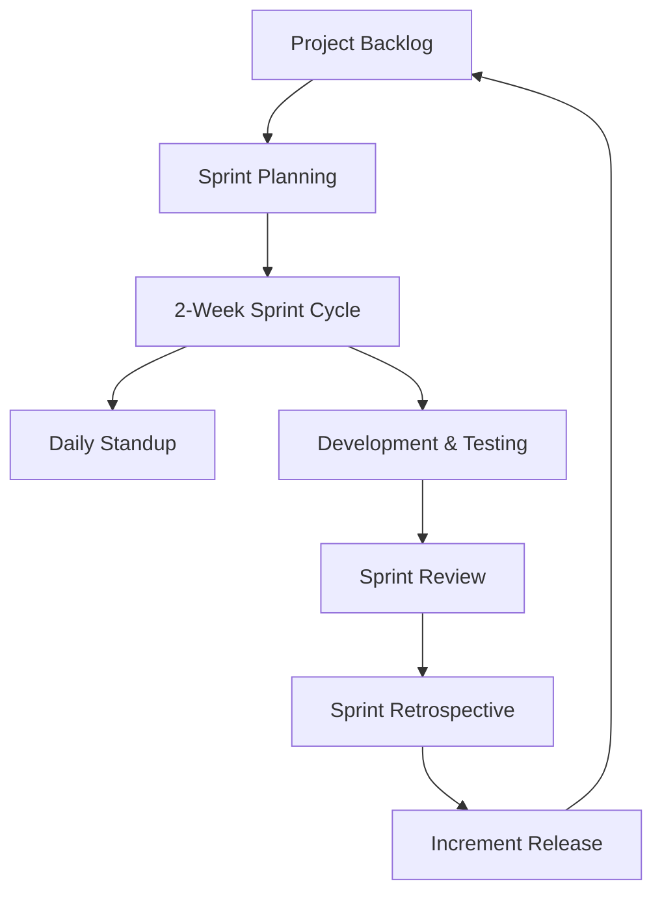
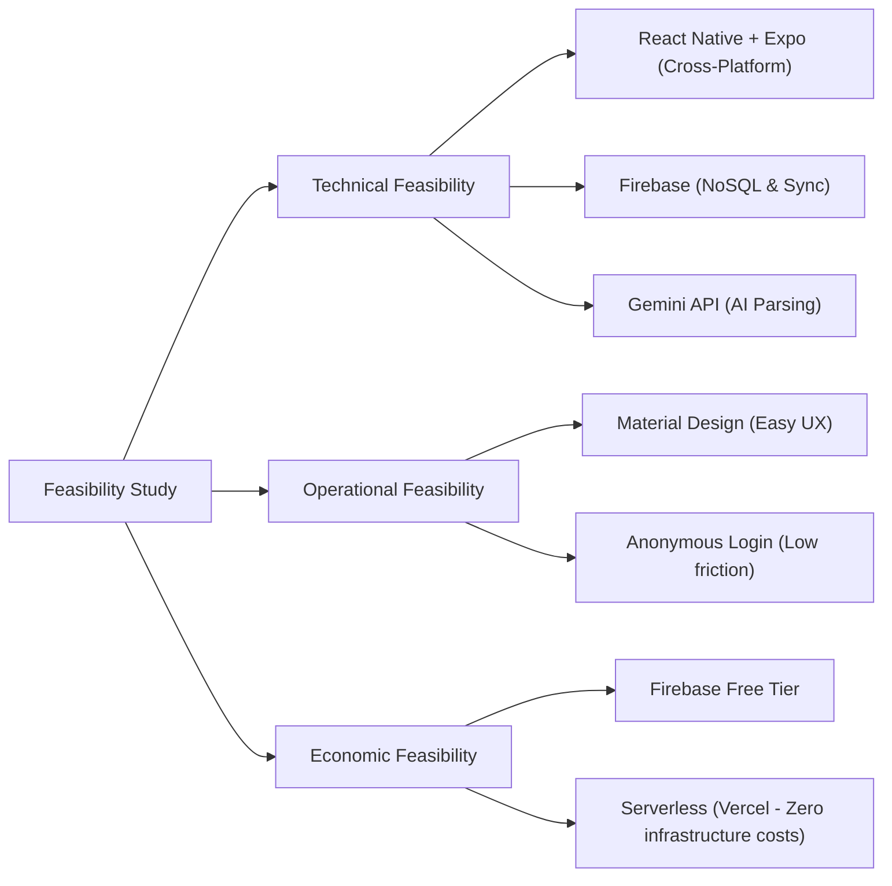
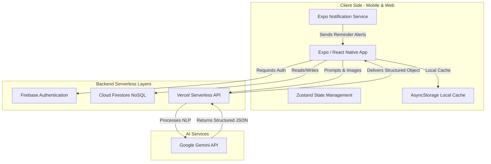
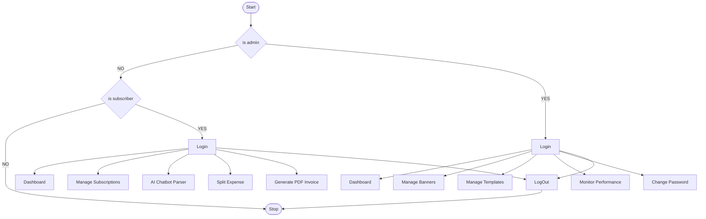

# M.Sc. (CA & IT) - III — 1st Project Presentation
## Subject: P23A4IP1 – Industrial Project - I
### Project Title: SubTrack AI — Intelligent Subscription & Expense Management System

---

## 1. Introduction & Project Overview

### 1.6 Project Profile

| Attribute | Details |
| :--- | :--- |
| **Project Title** | **SubTrack AI**: Intelligent Subscription & Expense Management System |
| **Academic Program** | M.Sc. (CA & IT) - Semester III |
| **Subject Code** | P23A4IP1 – Industrial Project - I |
| **Organization** | Academic Collaboration / Internal R&D Lab |
| **Project Duration** | 6 Months (June 2026 – December 2026) |
| **Type of Project** | Cross-Platform Mobile & Web Application with AI-Powered Automation |

---

### 1.7 Problem Statement

With the rapid expansion of the digital economy, subscription-based business models have become the standard for software, media entertainment, utilities, and professional services. However, this has led to a critical user pain point known as **"Subscription Fatigue"** and financial leakages:

1. **Unintended Renewals & Financial Loss:** Users often sign up for free trials or monthly plans and forget to cancel them before the renewal date. This leads to automated, unauthorized credit card/bank account deductions.
2. **Lack of Centralized Tracking:** Subscriptions are scattered across different platforms (Apple App Store, Google Play Store, standalone websites, direct credit cards). There is no single, unified dashboard to view total recurring costs.
3. **Complex Billing Cycles & Multi-currency:** Users struggle to track subscriptions renewing on different cycles (monthly, quarterly, semi-annually, yearly) and in different currencies (INR, USD, EUR), complicating budget forecasts.
4. **Manual Entry Friction:** Traditional expense-tracking apps require manual, tedious form-entry for every subscription. This friction causes users to abandon tracking apps.
5. **No Shared Expense Splitting:** Co-living expenses (e.g., shared Netflix, Spotify, or Wi-Fi bills) are difficult to split and track dynamically among friends or roommates.
6. **Inefficient Professional Billing:** Freelance professionals and small business owners frequently pay for subscription-based SaaS tools and fail to log or claim them as deductible business expenses with professional invoices.

---

### 1.8 Objectives & Scope of the Project

#### Primary Objectives:
* **Automate Discovery & Management:** Build a system that centralizes all subscription logs into a single, intuitive interface.
* **Proactive Alerts:** Implement a smart local and cloud notification system to warn users *before* billing renewals occur, allowing timely cancellations.
* **Integrate AI Capabilities:** Leverage large language models (LLMs) to parse natural language instructions (voice/text) and images (receipts/invoices) to automatically extract subscription information.
* **Streamline Split Billing & Invoicing:** Enable users to split subscription expenses and generate professional invoices for client billing or tax records.

#### Scope of the Project:
* **User Authentication:** Secure user sign-in via Google, Apple, and Anonymous authentication.
* **Interactive Dashboard:** Provide real-time charts illustrating monthly spend, category breakdowns, and a timeline of upcoming renewals.
* **SubTrack AI Assistant Chatbot:** An in-app assistant that accepts text commands (e.g., "Add Netflix subscription for 199 starting next Monday") in English, Hindi, and Hinglish. It also allows uploading images/documents to extract billing data.
* **Subscription Management:** CRUD operations on subscriptions, specifying price, cycle, category, custom colors, icons, and reminder settings.
* **Expense & Invoice Tracker:** Log individual expenses, split them among friends, and generate custom invoices with business branding and signatures.
* **Cross-Platform Compatibility:** Run seamlessly on Android, iOS, and Web browsers utilizing Expo/React Native.

---

### 1.9 SDLC Methodology

This project utilizes the **Agile Scrum Methodology**. This iterative approach ensures rapid feature deployment, flexibility to pivot based on testing, and continuous delivery of stable builds.

* **Sprint Cycles:** The development is divided into 2-week sprints, each focusing on a specific functional module (e.g., Auth, Dashboard, Database integration, AI Assistant, Invoice generation).
* **Backlog Management:** User stories are maintained and prioritized in a backlog.
* **Daily Standups:** Brief daily sync-ups to review progress and identify blockages.
* **Continuous Integration:** Regular code reviews and linting checks using tools like ESLint and React Doctor to maintain high code quality before production builds.

---

## 2. System Analysis

### 2.1 Existing System / Limitations

Currently, users track their subscriptions through the following methods:
* **Manual Logs (Excel/Spreadsheets):** Requires constant manual updates, lacks automated notifications, and has zero mobile integration.
* **Banking Apps:** Show deductions only *after* they have occurred. They do not predict future billing or help manage trial cancellations.
* **Traditional Expense Trackers:** General-purpose expense trackers require manual logging of every recurring expense. They do not specialize in subscription tracking or trial-expiry warnings.
* **No Multilingual AI support:** Existing global apps support only structured English forms, creating a language barrier for regional Indian users who express queries in Hinglish or Hindi.

---

### 2.2 Proposed Solution

**SubTrack AI** addresses these limitations through a targeted, intelligent approach:
* **Centralized Real-Time Sync:** Uses a fast, offline-first Firestore backend to sync data across all user devices.
* **AI-Driven Automation (Gemini Integration):** Eliminates manual data entry. Users can upload a PDF/image of a bill or type a message in Hinglish to log subscriptions.
* **Pre-Renewal Reminders:** Utilizes Expo local notifications and custom scheduling rules to prompt users 1, 3, or 5 days before a renewal.
* **Specialized Business Tools:** Integrated billing, split-expense calculation, and branded PDF invoice generation directly within a single dashboard.

---

### 2.3 Feasibility Study

#### 2.3.1 Technical Feasibility
* **Frontend:** React Native + Expo provides a single, high-performance codebase for iOS, Android, and Web.
* **Backend & Database:** Firebase Firestore handles real-time data sync and offline persistence out of the box. Vercel Serverless Functions allow hosting the API routes without server management.
* **AI Processing:** Google's Gemini API is highly capable of parsing multi-lingual (Hinglish/Gujarati/Hindi) text inputs and extracting structured JSON data.
* **Conclusion:** **Highly Feasible.** The chosen technologies are mature, well-documented, and actively supported.

#### 2.3.2 Operational Feasibility
* **User Interface:** The app uses Material-style layouts (React Native Paper) which are highly intuitive and familiar to users.
* **User Onboarding:** Offers Anonymous Firebase Auth, enabling users to try the app immediately without complex registration, maximizing operational adoption.
* **Conclusion:** **Highly Feasible.** The simple onboarding process and modern UI ensure high user retention and ease of operation.

#### 2.3.3 Economic Feasibility
* **Development Cost:** Zero cost for development IDEs (VS Code) and SDKs (Expo/React Native).
* **Infrastructure Cost:** Firebase and Vercel offer generous free tiers that easily accommodate initial prototypes and beta testing.
* **AI API Costs:** The Gemini Flash model is highly optimized, providing exceptionally low API costs per call, making it economically viable at scale.
* **Conclusion:** **Highly Feasible.** The project can be developed and maintained with minimal operational expenditure.

---

### 2.4 Requirement Specifications

#### 2.4.1 Functional Requirements (User Stories)

##### A. User Onboarding & Auth
* **As a user,** I want to sign in anonymously so that I can explore the app features without disclosing personal details immediately.
* **As a user,** I want to link my anonymous account with my Google or Apple account so that my data is saved permanently across multiple devices.

##### B. Subscription Management
* **As a user,** I can add, edit, view, and delete subscriptions (name, category, price, billing cycle, currency, and next billing date) so that my records stay updated.
* **As a user,** I want to toggle reminders and choose custom notification days (e.g., 1 day before, 3 days before) so that I never miss a cancellation window.

##### C. AI Assistant
* **As a user,** I can text the AI Assistant in English, Hindi, or Hinglish (e.g., *"Netflix ka ₹199 ka plan kal renew hoga"*) so that it automatically logs the subscription details for me.
* **As a user,** I can upload a photo of a billing receipt to the AI Assistant so that the model extracts the price, billing date, and service name.

##### D. Expense & Split Management
* **As a user,** I can log individual expenses and specify if they are split with friends, making joint subscription tracking transparent.
* **As a user,** I can generate and export a professional PDF invoice for subscription expenses to submit for business reimbursements.

---

#### 2.4.2 Non-Functional Requirements

* **Performance:**
  * App screens must render in under 100ms.
  * Real-time sync latency for Firestore updates must be less than 1.5 seconds under standard network conditions.
  * Local storage (AsyncStorage) must be used to load user preferences instantly on startup.
* **Security & Privacy:**
  * All user data must be scoped in Firestore using security rules (`request.auth.uid == resource.data.userId`).
  * API keys (e.g., Gemini API key) must be stored in secure server-side environment variables on Vercel, never exposed on the client mobile app.
* **Scalability:**
  * The serverless database (Firestore) and backend (Vercel Functions) must scale automatically to handle surges in concurrent users without manual intervention.

---

## 3. Technology Stack & Architecture

### 3.1 System Architecture Diagram

---

### 3.2 Technology Stack

#### 3.2.1 Frontend
* **Expo / React Native:** Cross-platform React framework used to compile native Android and iOS applications, as well as web targets, from a single codebase.
* **React Native Paper:** Material Design component library ensuring sleek, premium UI aesthetics.
* **Zustand:** Highly performant, lightweight state management library for managing global application state with minimal boilerplate.

#### 3.2.2 Backend
* **Node.js:** JavaScript runtime environment used to build API endpoints.
* **Vercel Serverless Functions:** Serverless hosting provider for API endpoints (`/api/reminders/parse` and `/api/reminders/parse-document`) to handle backend NLP tasks.

#### 3.2.3 Database & Authentication
* **Google Firebase Cloud Firestore:** Real-time NoSQL cloud database used to store user profiles, subscriptions, expenses, and invoices.
* **Firebase Authentication:** Handles secure Google, Apple, and Anonymous logins.

#### 3.2.4 Tools
* **VS Code:** Standard integrated development environment (IDE).
* **GitHub:** Version control and collaboration repository.
* **Postman:** API testing tool for Vercel backend endpoints.
* **Expo Go / EAS CLI:** Deployment and local testing platform.

---

### 3.3 Justification of Technology

* **Why Expo & React Native?**
  * *Alternative:* Native Java/Kotlin (Android) and Swift (iOS).
  * *Justification:* Building native apps separately doubles development time and cost. Expo allows code reuse across Android, iOS, and Web platforms while maintaining native performance.
* **Why Cloud Firestore over MySQL/PostgreSQL?**
  * *Alternative:* Relational databases (SQL).
  * *Justification:* SQL databases require setting up connection pools, servers, and database migration scripts. Cloud Firestore provides offline persistence out-of-the-box, automatic horizontal scaling, and native real-time listeners, which is perfect for real-time mobile updates.
* **Why Vercel Serverless Functions over Dedicated Node/Express Server?**
  * *Alternative:* Dedicated server on AWS EC2 or DigitalOcean.
  * *Justification:* Dedicated servers incur fixed monthly charges and require maintenance (OS patches, security rules). Vercel functions are zero-maintenance, scale to zero when not in use, and have zero baseline cost.
* **Why Gemini API over OpenAI GPT?**
  * *Alternative:* OpenAI GPT-4o.
  * *Justification:* Gemini offers a large context window, exceptionally fast inference, native support for multimodal inputs (images + text), and cost-effective pricing for developers. Additionally, it has superior native understanding of Hinglish (Hindi written in Latin script) and regional Indian languages, which fits the target user demographic.

---

## 6. System Flowchart

The system flowchart describes the operational flow of SubTrack AI, detailing the path a user takes from entering the app, interacting with the system, utilizing the AI parsing agent, and receiving proactive notifications.

### 6.1 Core System Process Flowchart

This flowchart outlines the main execution path of the mobile/web application, including database queries, state updates, and navigation decisions:

### 6.1.1 Tree-Based Flowchart Representation:

- 🏁 **Start Application**
  - ├── 👤 **is admin**
    - ├── 🟢 **YES** ──► **Login**
      - └── 📁 **Admin Operations:**
        - ├── 📊 Dashboard
        - ├── 📢 Manage Banners
        - ├── 📝 Manage Templates
        - ├── 📈 Monitor Performance
        - └── 🔑 Change Password
    - └── 🔴 **NO**
      - └── 👤 **is subscriber**
        - ├── 🟢 **YES** ──► **Login**
          - └── 📁 **Subscriber Operations:**
            - ├── 📊 Dashboard
            - ├── 📝 Manage Subscriptions
            - ├── 🤖 AI Chatbot Parser
            - ├── 👥 Split Expense
            - └── 📄 Generate PDF Invoice
        - └── 🔴 **NO** ──► 🏁 **Stop**
  - └── 🚪 **LogOut** (from any operation menu) ──► 🏁 **Stop**

### 6.2 Explanation of Flowchart Stages

1. **Authentication Gate:** The application first checks if a security token exists. If not, it requests sign-in, offering Google/Apple accounts for permanent storage or Anonymous authentication for immediate access.
2. **Real-time Synchronization:** On successful sign-in, the application establishes a Firestore real-time listener scoped to the user's ID (`users/{uid}`). This synchronization is reactive; any change on the server immediately flows to the local state (Zustand).
3. **AI Integration Flow:** When using the AI Assistant, raw data (text, voice transcript, or image) is securely packaged and sent to the Vercel backend. The serverless function delegates parsing to Google's Gemini LLM. The model converts freeform input into structured JSON fields (name, price, date, billing cycle). The client app converts this JSON into an editable preview form, allowing the user to verify accuracy before finalizing the database write.
4. **Local Alert Scheduling Flow:** Upon writing or editing a subscription, the system checks if reminders are enabled. It automatically schedules a local operating system alert (via `expo-notifications`) targeted at the specific number of days before the `nextBillingDate`.
5. **Expense and Invoicing Flow:** Users can either record simple expense records, split them with friends, or generate professional business-branded PDF invoices using templates powered by the Expo Print module.

